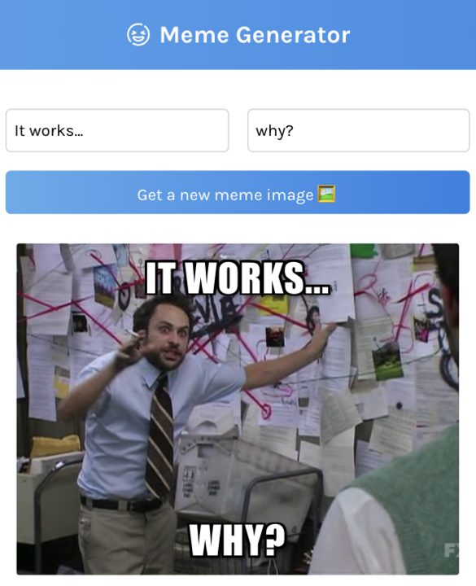

# Meme-Generator

This project is inspired by a Scrimba project that I made alongside the Learn React Course which I've found a great tool for learning the basics. Link below:
https://scrimba.com/learn/learnreact

Using React + Vite and Memes API https://api.imgflip.com/get_memes

## Features

- get new Meme image
- add text to the top and bottom of the image
